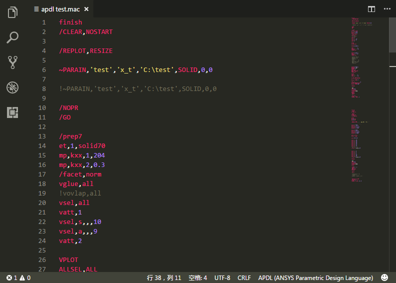

# APDL README

An extension with rich support for the APDL(ANSYS Parametric Design Languages) language.

## Features

Support file extensions:
- **.mac**
- **.ans**
- **.ansys.txt**
- **.ans.txt**
- **.ansys**
- **.apdl**

## Release Notes

**Version 0.1.1**: Update .

**V0.1.0**: Initial release .

